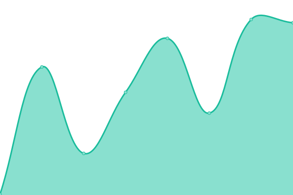
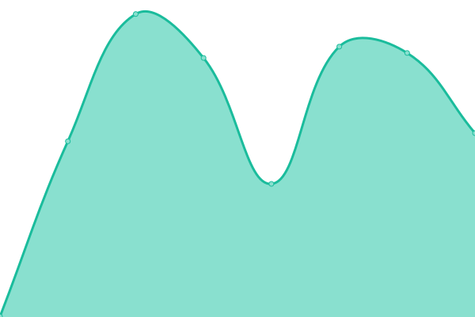
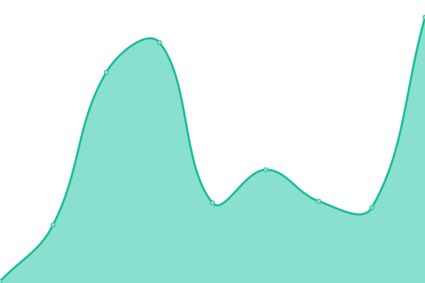
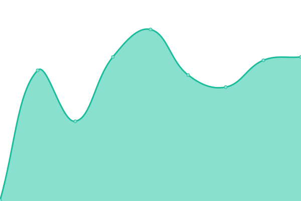

# [📈 Live Status](https://turtlecode84.github.io/status): <!--live status--> **🟩 All systems operational**

This repository contains the open-source uptime monitor and status page for [TurtleCode](https://turtlecode84.github.io/status), powered by [Upptime](https://github.com/upptime/upptime).

With [Upptime](https://upptime.js.org), you can get your own unlimited and free uptime monitor and status page, powered entirely by a GitHub repository. We use [Issues](https://github.com/turtlecode84/status/issues) as incident reports, [Actions](https://github.com/turtlecode84/status/actions) as uptime monitors, and [Pages](https://turtlecode84.github.io/status) for the status page.

<!--start: status pages-->
<!-- This summary is generated by Upptime (https://github.com/upptime/upptime) -->
<!-- Do not edit this manually, your changes will be overwritten -->
<!-- prettier-ignore -->
| URL | Status | History | Response Time | Uptime |
| --- | ------ | ------- | ------------- | ------ |
|  [TurtleCode.me](https://turtlecode.me) | 🟩 Up | [turtle-code-me.yml](https://github.com/TurtleCode84/status/commits/HEAD/history/turtle-code-me.yml) | 

 209ms
     
 | 

<a href="https://status.turtlecode.me/history/turtle-code-me">100.00%</a>
    

|  [TurtleCode Portfolio](https://portfolio.turtlecode84.repl.co) | 🟩 Up | [turtle-code-portfolio.yml](https://github.com/TurtleCode84/status/commits/HEAD/history/turtle-code-portfolio.yml) | 

 362ms
     
 | 

<a href="https://status.turtlecode.me/history/turtle-code-portfolio">100.00%</a>
    

|  [Turtle's Essays](https://essays.turtlecode.me) | 🟩 Up | [turtle-s-essays.yml](https://github.com/TurtleCode84/status/commits/HEAD/history/turtle-s-essays.yml) | 

 499ms
     
 | 

<a href="https://status.turtlecode.me/history/turtle-s-essays">100.00%</a>
    

|  [TurtleCode CDN](https://cdn.turtlecode.me) | 🟩 Up | [turtle-code-cdn.yml](https://github.com/TurtleCode84/status/commits/HEAD/history/turtle-code-cdn.yml) | 

 227ms
     
 | 

<a href="https://status.turtlecode.me/history/turtle-code-cdn">100.00%</a>
    

|  [TurtleCode84 Status Hub (this site)](https://status.turtlecode.me) | 🟩 Up | [turtle-code84-status-hub-this-site.yml](https://github.com/TurtleCode84/status/commits/HEAD/history/turtle-code84-status-hub-this-site.yml) | 

 229ms
     
 | 

<a href="https://status.turtlecode.me/history/turtle-code84-status-hub-this-site">100.00%</a>
    

<!--end: status pages-->

[**Visit our status website →**](https://turtlecode84.github.io/status)

## 📄 License

- Powered by: [Upptime](https://github.com/upptime/upptime)
- Code: [MIT](./LICENSE) © [TurtleCode](https://turtlecode84.github.io/status)
- Data in the `./history` directory: [Open Database License](https://opendatacommons.org/licenses/odbl/1-0/)
