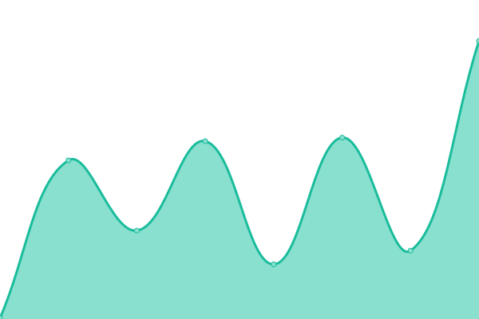
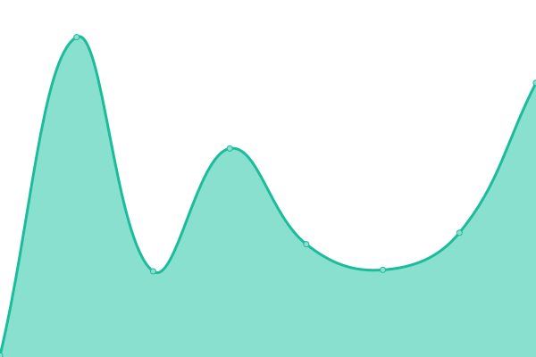

# [📈 Live Status](https://turtlecode84.github.io/status): <!--live status--> **🟩 All systems operational**

This repository contains the open-source uptime monitor and status page for [TurtleCode](https://turtlecode84.github.io/status), powered by [Upptime](https://github.com/upptime/upptime).

With [Upptime](https://upptime.js.org), you can get your own unlimited and free uptime monitor and status page, powered entirely by a GitHub repository. We use [Issues](https://github.com/turtlecode84/status/issues) as incident reports, [Actions](https://github.com/turtlecode84/status/actions) as uptime monitors, and [Pages](https://turtlecode84.github.io/status) for the status page.

<!--start: status pages-->
<!-- This summary is generated by Upptime (https://github.com/upptime/upptime) -->
<!-- Do not edit this manually, your changes will be overwritten -->
<!-- prettier-ignore -->
| URL | Status | History | Response Time | Uptime |
| --- | ------ | ------- | ------------- | ------ |
|  [Main Website](https://turtlecode.tech) | 🟩 Up | [main-website.yml](https://github.com/TurtleCode84/status/commits/HEAD/history/main-website.yml) | 

 168ms
     
 | 

<a href="https://status.turtlecode.tech/history/main-website">100.00%</a>
    

|  [Content Delivery Node](https://cdn.turtlecode.tech) | 🟩 Up | [content-delivery-node.yml](https://github.com/TurtleCode84/status/commits/HEAD/history/content-delivery-node.yml) | 

 169ms
     
 | 

<a href="https://status.turtlecode.tech/history/content-delivery-node">100.00%</a>
    

|  [Status Hub (this site)](https://status.turtlecode.tech) | 🟩 Up | [status-hub-this-site.yml](https://github.com/TurtleCode84/status/commits/HEAD/history/status-hub-this-site.yml) | 

 174ms
     
 | 

<a href="https://status.turtlecode.tech/history/status-hub-this-site">100.00%</a>
    

|  [TrackTask](https://tracktask.eu.org) | 🟩 Up | [track-task.yml](https://github.com/TurtleCode84/status/commits/HEAD/history/track-task.yml) | 

 288ms
     
 | 

<a href="https://status.turtlecode.tech/history/track-task">100.00%</a>
    

<!--end: status pages-->

[**Visit our status website →**](https://turtlecode84.github.io/status)

## 📄 License

- Powered by: [Upptime](https://github.com/upptime/upptime)
- Code: [MIT](./LICENSE) © [TurtleCode](https://turtlecode84.github.io/status)
- Data in the `./history` directory: [Open Database License](https://opendatacommons.org/licenses/odbl/1-0/)
